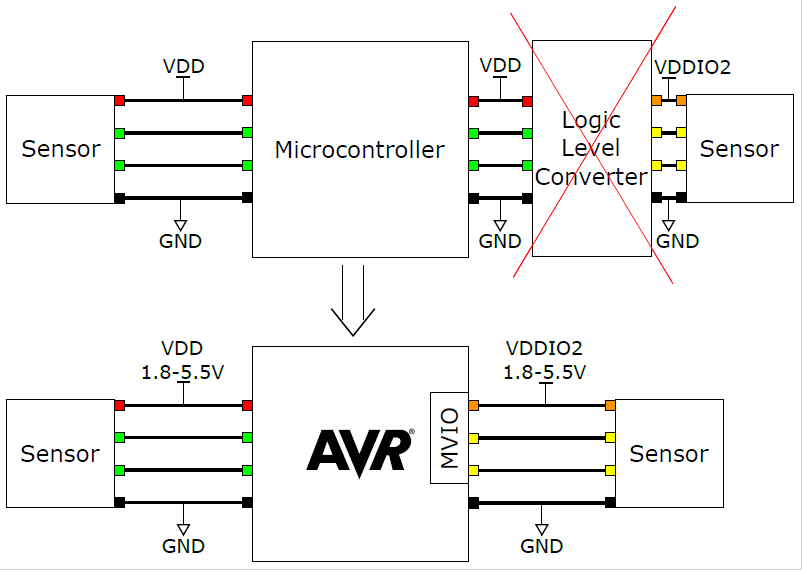

# Getting Started with Multi Voltage I/O (MVIO)

A new feature introduced in the AVR® DB Family is the Multi-Voltage I/O (MVIO) peripheral. In this example, VDDIO2 supplies a different voltage level PORTC, than on the rest of the PORTs, which are supplied by VDD. It is possible to monitor this voltage level with the internal analog-to-digital converter (ADC) and also possible to get an interrupt when the voltage level for the MVIO, called VDDIO2, goes in and out of acceptable voltage range. 

These examples show how the Multi-Voltage I/O feature works on the AVR DB family of microcontrollers.

* [**Polling VDDIO2 Status**](reading-the-status-bit.X/):
  Checking if the VDDIO2 voltage is within acceptable range by reading the Status bit.
  
* [**Interrupt on VDDIO2 Status**](interrupt-on-vddio2-status.X/):
  Make use of the interrupt that occurs when the Status bit changes state.

* [**Measuring VDDIO2 with ADC**](measuring-vddio2.X/):
  Use the internal ADC to measure the VDDIO2 voltage.

* [**Blink a 3V LED with VDD at 1.8V**](blinking-a-3v0-led-with-vdd-at-1v8.X):
  Basic example of MVIO blinking an LED with forward voltage higher than VDD.

## Related Documentation

* [TB3287 - Getting Started With MVIO](https://microchip.com/DS90003287) 
* [AVR128DB48 Device Page](https://www.microchip.com/wwwproducts/en/AVR128DB48)
* [AVR128DB48 Curiosity Nano User Guide](https://www.microchip.com/DS50003037)

## Software Used
- [MPLAB® X IDE v5.45](https://www.microchip.com/mplab/mplab-x-ide) or newer
- [MPLAB® Xpress IDE](https://www.microchip.com/xpress) (alternative to MPLAB X IDE)
- [XC8 Compiler v2.32](https://www.microchip.com/mplab/compilers) or newer
- [MPLAB® Code Configurator (MCC) v4.1.0](https://www.microchip.com/mplab/mplab-code-configurator) or newer
- [MPLAB® Melody Library 1.37.30 or newer](https://www.microchip.com/mplab/mplab-code-configurator) or newer
- [MCC Device Libraries 8-bit AVR MCUs 2.7.0](https://www.microchip.com/mplab/mplab-code-configurator) or newer
- [Microchip AVR128DB48 Device Support Pack AVR-Dx_DFP 1.7.98](https://packs.download.microchip.com/) or newer
## Hardware Used

* [AVR128DB48 Curiosity Nano](https://www.microchip.com/DevelopmentTools/ProductDetails/PartNO/EV35L43A)
* One >15Ω resistor
* One LED with forward voltage of ~3V

## Setup

* Connect the hardware together as seen in the schematic of the [application note](https://microchip.com/DS90003287)
* For each of the use cases

## Operation
* Connect the AVR128DB48 Curiosity Nano to a computer using a USB cable
* Clone the repository or download the zip to get the source code
* Open the project folder you want to run with MPLAB X
* Compile and run the code

## Changing Voltage
Drag and drop one of the following files to the "Curiosity" disc on your computer:
* VDD1V8.txt - Sets voltage to 1.8V
* VDD3V3.txt - Sets voltage to 3.3V

## Conclusion
After going through this example, you should have a better understanding of how to set up the MVIO peripheral to utilize the internal level shifters to communicate with and drive external components.  
