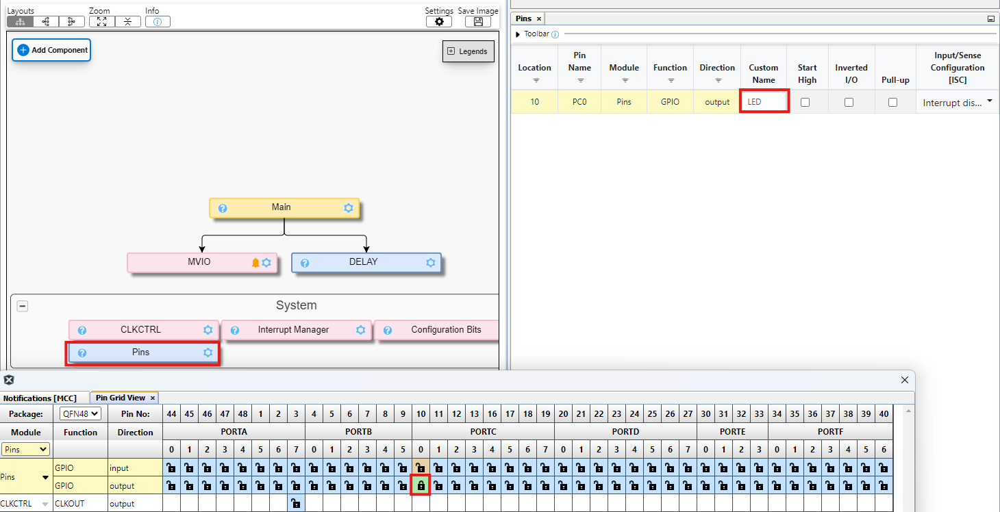

<!-- Please do not change this logo with link -->

# Blink a 3V LED with VDD at 1.8V
This example shows how to configure the Multi Voltage Input Output (MVIO) on the AVR® DB
microcontrollers with the MCC Melody Library.
The example checks if the external voltage supply, connected to VDDIO2,
is within an acceptable range. This is done by reading the status bit. While
the VDDIO2 voltage is in the correct range, the external 3V LED connected to PC0
will blink. The LED will continue to blink, even if the main voltage supply
(VDD) drops to 1.8V. This is because PORTC is supplied by VDDIO2 and not by VDD.

	

## Related Documentation

- [AVR128DB48 device page](https://www.microchip.com/wwwproducts/en/AVR128DB48)
- [MPLAB Code Configurator](https://www.microchip.com/en-us/development-tools-tools-and-software/embedded-software-center/mplab-code-configurator)
- [AVR128DB48 Curiosity Nano Hardware User Guide](https://www.microchip.com/DevelopmentTools/ProductDetails/PartNO/EV35L43A)

## Software Used

- [MPLAB® X IDE v6.20](https://www.microchip.com/mplab/mplab-x-ide) or newer
- [MPLAB® Xpress IDE](https://www.microchip.com/xpress) (alternative to MPLAB X IDE)
- [XC8 Compiler v3.00](https://www.microchip.com/mplab/compilers) or newer
- [MPLAB® Code Configurator (MCC) v5.5.1](https://www.microchip.com/mplab/mplab-code-configurator) or newer
- [MPLAB® Melody Library 2.8.1 or newer](https://www.microchip.com/mplab/mplab-code-configurator) or newer
- [MCC Device Libraries 8-bit AVR MCUs 4.12.0](https://www.microchip.com/mplab/mplab-code-configurator) or newer
- [Microchip AVR128DB48 Device Support Pack AVR-Dx_DFP 2.7.321](https://packs.download.microchip.com/) or newer
-  MPLAB Data Visualizer in MPLAB X IDE or any other serial terminal application

## Hardware Used

- [AVR128DB48 Curiosity Nano](https://www.microchip.com/DevelopmentTools/ProductDetails/PartNO/EV35L43A)
- One >15Ω resistor
- One LED with forward voltage of ~3V

## Peripherals Configuration using MCC

### Added Peripherals

- This **Builder** tab shows the finished system, with the added MVIO and DELAY peripheral.

- Click **Add Component** and add the MVIO driver.

- Click **Add Component** and add the DELAY driver.

- Configure the IO PIN *PC0* as output and name it *LED*.

### Main Code

In this demonstration, the code in **main.c** contains a simple function that calls the MVIO driver API *MVIOisOK()* to check whether the VDDIO2 is within acceptable levels. If the voltage is within acceptable levels, an LED (connected to PC0) will turn on and off with a delay of 250 ms, creating a visual blinking OK signal. Note that the CNANO hardware must be modified by adding an LED as described in the [initial section of this example](#blink-a-3v-led-with-vdd-at-18v).

- The value that triggers the VDDIO2 below range can be found in the datasheet under [Datasheet - Electrical Characteristics](https://www.microchip.com/wwwproducts/en/AVR128DB48), check the website for latest datasheet.

## Setup

- Connect the hardware together as documented in the image at the top, with details in [TB3287 - Getting Started With MVIO](https://microchip.com/DS90003287). **Review this document to understand how to modify the On-board voltage regulator on the CNANO board**.
- Connect the AVR128DB48 Curiosity Nano board to your computer using a USB cable
- Download and install all software components as listed under 'Software Used' (note that MPLAB Xpress IDE is an online tool that cannot be downloaded)

- Note this example is part of the series *Getting Started with MVIO*, see the series  [**README.md**](../README.md) for more information.

## Operation

1. Download the zip file or clone the example to get the source code
1. Open the .X file with the MPLAB® X IDE
1. Program the project to the AVR128DB48 Curiosity Nano:
	- First clean and build the project by pressing the *Clean and Build Main Project* button

    

	- Then make and program the project to the AVR128DB48 by clicking the *Make and Program Device Main Project* button

    

1. Connect the external voltage supply and the LED will Toggle with a software delay. The LED will continue to blink until the voltage is too low.

## Summary

This example shows how to:
* Add and configure MVIO driver
* Toggle the PC0 pin if MVIO supply voltage is within an acceptable range.