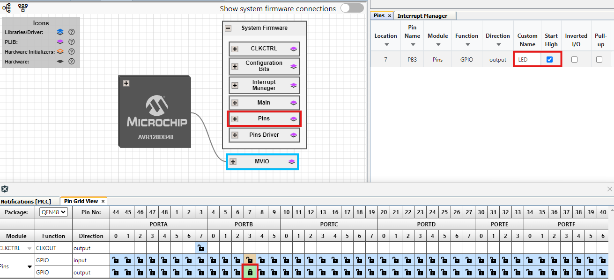

<!-- Please do not change this logo with link -->

# Interrupt on VDDIO2 Status
This example shows how to configure the Multi Voltage Input Ooutput (MVIO) on the AVR® DB Family of microcontrollers with the Melody MCC Library. This example generates an interrupt if the VDDIO2 voltage goes below the minimum acceptable voltage, toggling the onboard LED off.

	

## Related Documentation

- [AVR128DB48 device page](https://www.microchip.com/wwwproducts/en/AVR128DB48)
- [MPLAB Code Configurator](https://www.microchip.com/en-us/development-tools-tools-and-software/embedded-software-center/mplab-code-configurator)
- [AVR128DB48 Curiosity Nano Hardware User Guide](https://www.microchip.com/DevelopmentTools/ProductDetails/PartNO/EV35L43A)

## Software Used

- [MPLAB® X IDE v6.20](https://www.microchip.com/mplab/mplab-x-ide) or newer
- [MPLAB® Xpress IDE](https://www.microchip.com/xpress) (alternative to MPLAB X IDE)
- [XC8 Compiler v3.00](https://www.microchip.com/mplab/compilers) or newer
- [MPLAB® Code Configurator (MCC) v5.5.1](https://www.microchip.com/mplab/mplab-code-configurator) or newer
- [MPLAB® Melody Library 2.8.1 or newer](https://www.microchip.com/mplab/mplab-code-configurator) or newer
- [MCC Device Libraries 8-bit AVR MCUs 2.8.1](https://www.microchip.com/mplab/mplab-code-configurator) or newer
- [Microchip AVR128DB48 Device Support Pack AVR-Dx_DFP 2.7.321](https://packs.download.microchip.com/) or newer
-  MPLAB Data Visualizer in MPLAB X IDE or any other serial terminal application

## Hardware Used

- Variable external power supply (1.5V - 3.3V)
- [AVR128DB48 Curiosity Nano](https://www.microchip.com/DevelopmentTools/ProductDetails/PartNO/EV35L43A)

## Peripherals Configuration using MCC

### Added Peripherals

- Add the MVIO Driver found under *Device Resources*

- The **Builder** tab shows the system, with the added *MVIO peripheral*.  Click on the *MVIO block*, to enable the VDDIO2 interrupt in the driver configuration *Easy View*.

- Enabling *Global Interrupts* is set in the *Interrupt Manager*.

- Configure the IO PIN *PB3* as output, which is connected to the LED0 on the CNANO, and name it *LED*. Enable Start High.

### Main code
In this demonstration, a callback function is defined in **main.c**. This callback function simply turns on the LED on the CNANO. In the *main()* function, the callback function is registered with the MVIO driver. As a result, the LED turns on whenever the voltage on VDDIO2 falls below the specified threshold (as given in the data sheet, see below) and hence an interrupt is triggered.

- The value that triggers the VDDIO2 below range can be found in the datasheet under [Datasheet - Electrical Characteristics](https://www.microchip.com/wwwproducts/en/AVR128DB48), check the website for latest datasheet.

## Setup

- Connect the hardware together as documented in the image at the top, with details in [TB3287 - Getting Started With MVIO](https://microchip.com/DS90003287)
- Connect the AVR128DB48 Curiosity Nano board to your computer using a USB cable
- Download and install all software components as listed under 'Software Used' (note that MPLAB Xpress IDE is an online tool that cannot be downloaded)

    
</img>

- Note this example is part of the series *Getting Started with MVIO*, see the series  [**README.md**](../README.md) for more information

## Operation

1. Download the zip file or clone the example to get the source code
1. Open the .X file with the MPLAB® X IDE
1. Program the project to the AVR128DB48 Curiosity Nano:
	- First clean and build the project by pressing the *Clean and Build Main Project* button
	
	- Then make and program the project to the AVR128DB48 by clicking the *Make and Program Device Main Project* button
	
1. Lower the external voltage supply to 1.5V and LED will turn on.

## Summary

This example shows how to:
* Add and configure MVIO driver support with interrupts enabled
* Toggle the CNANO LED when an MVIO interrupt occurs, i.e. when the MVIO supply voltage goes below typical minimum.
