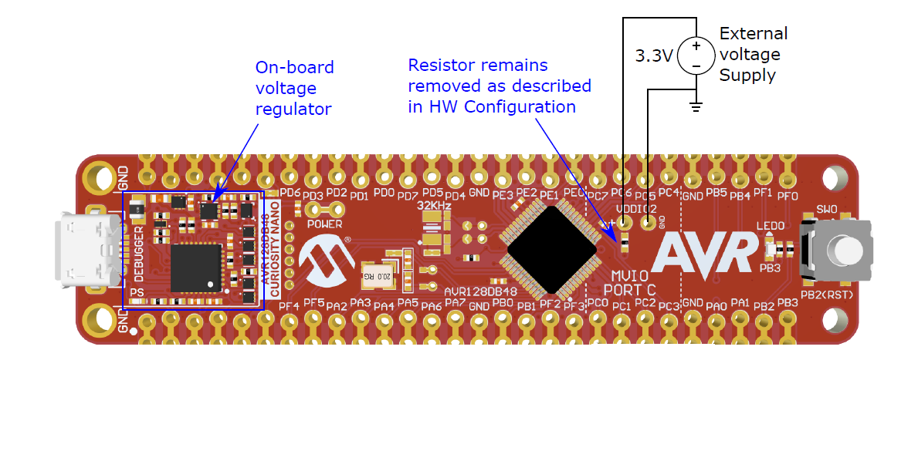

<!-- Please do not change this logo with link -->

# Measuring VDDIO2 with ADC
This example shows how to configure the ADC to measure VDDIO2 on the AVR® DB Family of microcontrollers with the Melody MCC Library.

	

## Related Documentation

- [AVR128DB48 device page](https://www.microchip.com/wwwproducts/en/AVR128DB48)
- [MPLAB Code Configurator](https://www.microchip.com/en-us/development-tools-tools-and-software/embedded-software-center/mplab-code-configurator)
- [AVR128DB48 Curiosity Nano Hardware User Guide](https://www.microchip.com/DevelopmentTools/ProductDetails/PartNO/EV35L43A)

## Software Used

- [MPLAB® X IDE v6.20](https://www.microchip.com/mplab/mplab-x-ide) or newer
- [MPLAB® Xpress IDE](https://www.microchip.com/xpress) (alternative to MPLAB X IDE)
- [XC8 Compiler v3.00](https://www.microchip.com/mplab/compilers) or newer
- [MPLAB® Code Configurator (MCC) v5.5.1](https://www.microchip.com/mplab/mplab-code-configurator) or newer
- [MPLAB® Melody Library 2.8.1 or newer](https://www.microchip.com/mplab/mplab-code-configurator) or newer
- [MCC Device Libraries 8-bit AVR MCUs 4.12.0](https://www.microchip.com/mplab/mplab-code-configurator) or newer
- [Microchip AVR128DB48 Device Support Pack AVR-Dx_DFP 2.7.321](https://packs.download.microchip.com/) or newer
-  MPLAB® Data Visualizer in MPLAB® X IDE or any other serial terminal application

## Hardware Used

- Variable external power supply (1.5 V - 3.3 V)
- [AVR128DB48 Curiosity Nano](https://www.microchip.com/DevelopmentTools/ProductDetails/PartNO/EV35L43A)

## Peripherals Configuration using MCC

### Added Peripherals

- Add the ADC Driver found under *Device Resources*

- Add the ADC Driver found under *Device Resources*

- Configure the VREF peripheral to provide a reference of 1.024 V, which will be sufficient to measure the VDDIO2/10.

- Configure the differential ADC peripheral to measure 16 samples with the positive input to VDDIO2/10. Configure the resolution to be 12 bits.

- No configuration is necessary in the MVIO driver, since interrupts will not be used.

### Main code

For this demonstration, the *main()* function in **main.c** includes code for reading and calculating the voltage in mV for the second voltage domain (VDDIO2). The result of this measurement can be used in an application or output via USART to, for example, the DataVisualizer for processing.

## Setup

- Connect the hardware together as documented in the image above, with details in [TB3287 - Getting Started With MVIO](https://microchip.com/DS90003287)
- Connect the AVR128DB48 Curiosity Nano board to your computer using a USB cable
- Download and install all software components as listed under 'Software Used' (note that MPLAB Xpress IDE is an online tool that cannot be downloaded)
- Note this example is part of the series *Getting Started with MVIO*, see the series  [**README.md**](../README.md) for more information.

## Operation

1. Download the zip file or clone the example to get the source code.
2. Open the .X file with the MPLAB® X IDE.
3. Program the project to the AVR128DB48 Curiosity Nano:
- First clean and build the project by pressing the *Clean and Build Main Project* button.

- Then make and program the project to the AVR128DB48 by clicking the *Make and Program Device Main Project* button.

4. Running in debug mode will allow visualization of the result variable which contains the **VDDIO2** voltage.
- First add the **voltage** variable to a new watch.

- Add a breakpoint at the voltage calculation line, start the debugger, hit play to take measurement. Continue to hit play to update the voltage.

## Summary

This example shows how to add ADC driver support and use the driver API to measure the VDDIO2 supply.
