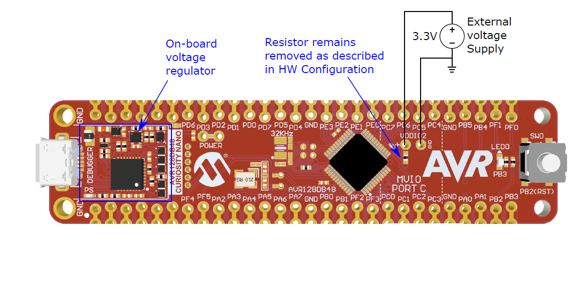
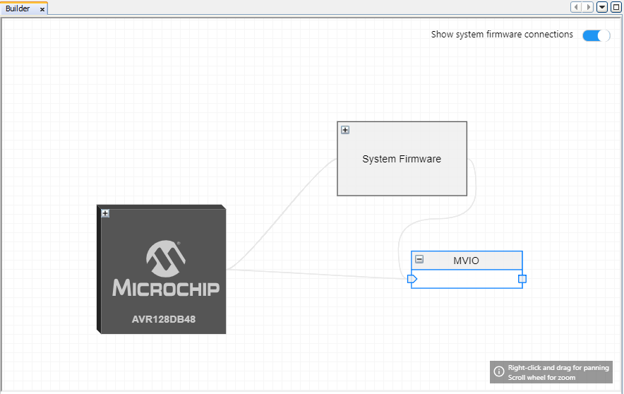

<!-- Please do not change this logo with link -->

# Reading the VDDIO2 Status Bit
This example shows how to configure the Multi Voltage IO (MVIO) on the AVR® DB Family of microcontrollers with the MCC Melody Library. This example checks if the VDDIO2 voltage is within an acceptable range, by reading the Status bit.

	

## Related Documentation

- [AVR128DB48 device page](https://www.microchip.com/wwwproducts/en/AVR128DB48)
- [MPLAB Code Configurator](https://www.microchip.com/en-us/development-tools-tools-and-software/embedded-software-center/mplab-code-configurator)
- [AVR128DB48 Curiosity Nano Hardware User Guide](https://www.microchip.com/DevelopmentTools/ProductDetails/PartNO/EV35L43A)

## Software Used

- [MPLAB® X IDE v6.20](https://www.microchip.com/mplab/mplab-x-ide) or newer
- [MPLAB® Xpress IDE](https://www.microchip.com/xpress) (alternative to MPLAB X IDE)
- [XC8 Compiler v3.00](https://www.microchip.com/mplab/compilers) or newer
- [MPLAB® Code Configurator (MCC) v5.5.1](https://www.microchip.com/mplab/mplab-code-configurator) or newer
- [MPLAB® Melody Library 2.8.1 or newer](https://www.microchip.com/mplab/mplab-code-configurator) or newer
- [MCC Device Libraries 8-bit AVR MCUs 4.12.0](https://www.microchip.com/mplab/mplab-code-configurator) or newer
- [Microchip AVR128DB48 Device Support Pack AVR-Dx_DFP 2.7.321](https://packs.download.microchip.com/) or newer
-  MPLAB Data Visualizer in MPLAB X IDE or any other serial terminal application

## Hardware Used

- [AVR128DB48 Curiosity Nano](https://www.microchip.com/DevelopmentTools/ProductDetails/PartNO/EV35L43A)

## Peripherals Configuration using MCC

### Added Peripherals

- Add the MVIO Driver found under *Device Resources*

- The **Builder** tab shows the system, with the added MVIO peripheral.

### Main Code

In this demonstration, the API function *MVIO_isOK()* provided by the MVIO driver is called in the *main()* application function to check the status of the second voltage domain (VDDIO2). If the function returns *true*, the voltage on VDDIO2 is within acceptable levels. If *false* is returned, VDDIO2 falls outside acceptable voltage levels. This information can be used by the application to take further action based on the state of VDDIO2.

- The value that triggers the VDDIO2 below range can be found in the datasheet under [Datasheet - Electrical Characteristics](https://www.microchip.com/wwwproducts/en/AVR128DB48), check the website for latest datasheet.

## Setup

- Connect the hardware together as documented in the image above, with details in [TB3287 - Getting Started With MVIO](https://microchip.com/DS90003287)
- Connect the AVR128DB48 Curiosity Nano board to your computer using a USB cable
- Download and install all software components as listed under 'Software Used' (note that MPLAB Xpress IDE is an online tool that cannot be downloaded)
- Note this example is part of the series *Getting Started with MVIO*, see the series  [**README.md**](../README.md) for more information.

## Operation

1. Download the zip file or clone the example to get the source code
1. Open the .X file with the MPLAB® X IDE
1. Insert your application code in the **main.c** file, which will execute when the voltage is within an acceptable range.
1. Program the project to the AVR128DB48 Curiosity Nano:
	- First clean and build the project by pressing the *Clean and Build Main Project* button

	

    - Then make and program the project to the AVR128DB48 by clicking the *Make and Program Device Main Project* button

    

## Summary

This example shows how to add MVIO driver support, and use the driver API to check the status of VDDIO2.
